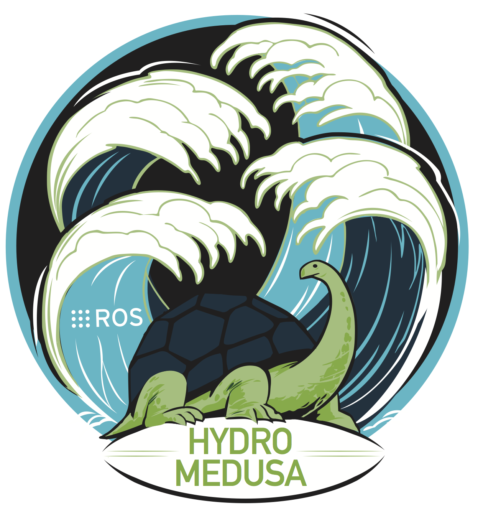

# remaro-repo-template

## Overview

Lorem ipsum dolor sit amet, consectetur adipiscing elit, sed do eiusmod tempor incididunt ut labore et dolore magna aliqua. Ut enim ad minim veniam, quis nostrud exercitation ullamco laboris nisi ut aliquip ex ea commodo consequat. Duis aute irure dolor in reprehenderit in voluptate velit esse cillum dolore eu fugiat nulla pariatur. Excepteur sint occaecat cupidatat non proident, sunt in culpa qui officia deserunt mollit anim id est laborum.

## Acknowledgements

<a href="https://remaro.eu/">
    
</a>

This work is part of the Reliable AI for Marine Robotics (REMARO) Project. For more info, please visit: <a href="https://remaro.eu/">https://remaro.eu/

<br>

<a href="https://research-and-innovation.ec.europa.eu/funding/funding-opportunities/funding-programmes-and-open-calls/horizon-2020_en">
    
</a>

This project has received funding from the European Union's Horizon 2020 research and innovation programme under the Marie Skłodowska-Curie grant agreement No. 956200.

## Setup

### Dependencies

Lorem ipsum dolor sit amet, consectetur adipiscing elit, sed do eiusmod tempor incididunt ut labore et dolore magna aliqua.

```
Lorem ipsum
dolor sit amet
onsectetur adipiscing elit
```

### Installation

Lorem ipsum dolor sit amet, consectetur adipiscing elit, sed do eiusmod tempor incididunt ut labore et dolore magna aliqua.

```
Lorem ipsum
dolor sit amet
onsectetur adipiscing elit
```

## Usage

### Example 1 Description

<a href="https://github.com/">
    
</a>

Lorem ipsum dolor sit amet, consectetur adipiscing elit, sed do eiusmod tempor incididunt ut labore et dolore magna aliqua.

```
Lorem ipsum
dolor sit amet
onsectetur adipiscing elit
```

### Example 2 Description

<a href="https://www.ros.org/">
    
</a>

Lorem ipsum dolor sit amet, consectetur adipiscing elit, sed do eiusmod tempor incididunt ut labore et dolore magna aliqua.

```
Lorem ipsum
dolor sit amet
onsectetur adipiscing elit
```